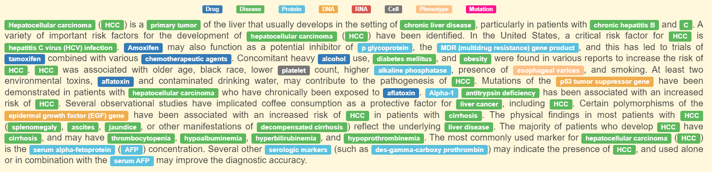
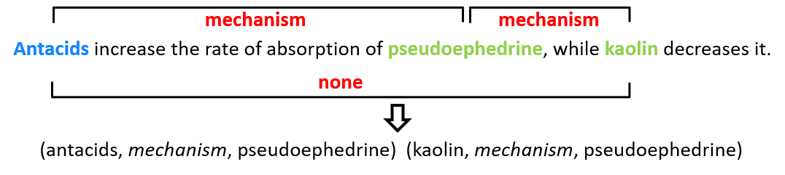

# BioNLP-progress #
Repository to track the progress in Biomedical Natural Language Processing (BioNLP), including the datasets and the current state-of-the-art for the most common BioNLP tasks.

## English ##
### [BioNER](https://github.com/lingluodlut/BioNER-Progress) ###

**Named entity recognition (NER)** is the problem of finding references to entities (mentions) in natural language text, and labeling them with their location and type. In biomedical domain, **biomedical NER (BioNER)** focuses on the biomedical entities like gene, protein, chemical, disease, mutation, etc. 

- [Papers](https://github.com/lingluodlut/BioNER-Progress/blob/master/BioNER_paper.md)
- [SOTA](https://github.com/lingluodlut/BioNER-Progress/blob/master/BioNER_sota.md)
 

### BioRE(Building) ###

**Relation Extraction (RE)** is the problem of extracting pairs of entities with relations from unstructured text in natural language text. In biomedical domain, the gold of **biomedical RE (BioRE)** is to automatically capture valuable biomedical relations, such as protein-protein interactions (PPIs), drug-drug interactions (DDIs) and chemical-protein interactions (CPIs), from the unstructured biomedical text with high accuracy and efficiency through advanced natural language processing (NLP) and machine learning techniques.Most BioRE methods are pipelined methods that decompose the extraction process into two subtasks and address them incrementally. First, biomedical entity mentions in a given text are recognized using the technologies of NER. Here, we focus the second subtask, classifying each entity pair into the task-specific relations (i.e., relation classification, RC).  

- Papers
- SOTA

## Chinese ##
Building.....